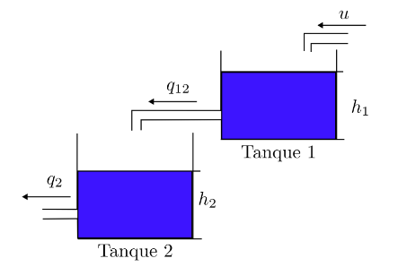

# Controle de um Sistema de Dois Tanques

## 📌 Objetivo do Projeto

O objetivo deste projeto é **projetar um controlador** para um sistema composto por dois tanques de água interconectados. A meta é **regular o nível de água** no segundo tanque (*h₂*) para um valor de referência desejado, manipulando a vazão de entrada (*u*) no primeiro tanque.

O sistema será **linearizado** em torno de um ponto de operação específico para facilitar o projeto de um controlador linear.

---

## ⚙️ Especificações e Requisitos de Projeto

O controlador deve atender aos seguintes critérios de desempenho ao operar próximo ao ponto de equilíbrio especificado e rastrear uma referência degrau.

### 🔹 Ponto de Equilíbrio para Linearização
- **Altura no Tanque 1 (h₁):** 0,6 m  
- **Altura no Tanque 2 (h₂):** 0,3 m

### 🔹 Desempenho para um Degrau de Referência de 0,8 m
- **Sobressinal Máximo (MS):** < 5%  
- **Tempo de Assentamento (tₛ):** < 8 segundos  
- **Erro em Regime Permanente:** Zero para referências do tipo degrau

---

## 📊 Visão Geral do Sistema

O sistema de dois tanques é composto por:
1. **Tanque 1** – recebe uma vazão de entrada controlada (*u*).  
2. **Tanque 2** – recebe água do Tanque 1 e representa a variável controlada (*h₂*).  

O problema de controle busca garantir rastreamento preciso e rejeição de perturbações, atendendo a todos os requisitos de desempenho transitório e de regime permanente.

